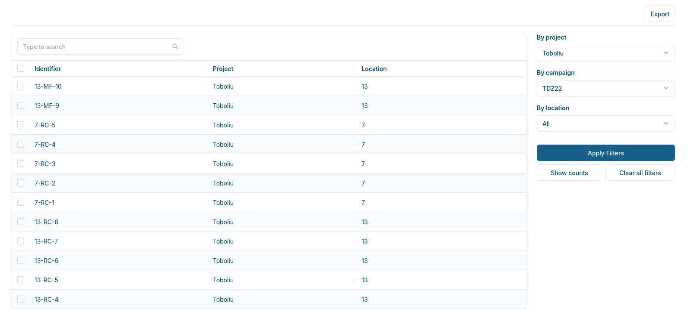
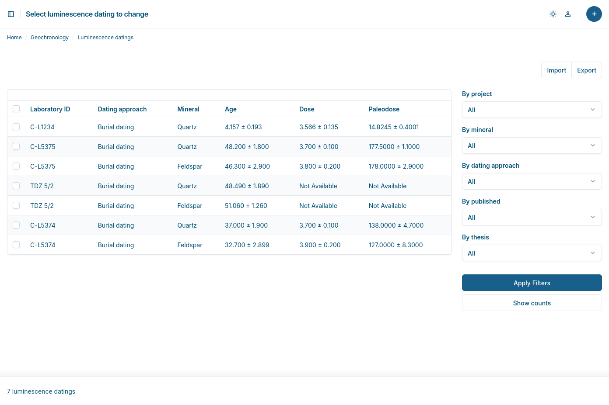

The Cologne Geomorphological Database System (CGDB)  is a comprehensive information system for managing complex geoscientific research data. It is specifically designed to support small research projects that must adhere to strict data management requirements set by funding bodies but often lack the financial and human resources to do so. The framework supports the transformation of raw research data into scientific knowledge. It addresses critical challenges, such as the rapid increase in the volume, variety, and complexity of geoscientific datasets, data heterogeneity, spatial complexity, and the need to comply with the FAIR (Findable, Accessible, Interoperable, and Reusable) principles. The approach optimises the research management process by enhancing scalability and enabling interdisciplinary integration. It is adaptable to evolving research requirements and supports various data types and methodological approaches, such as machine learning and deep learning, that place high demands on the data and their formats. 



## Technology Stack

CGDB is built with:
- **[Django 6.0](https://www.djangoproject.com/)** - Web framework and ORM
- **[Django Unfold](https://github.com/unfoldadmin/django-unfold)** - Modern admin interface
- **[Dagster](https://dagster.io/)** (optional) - Data orchestration and ETL pipelines

## Requirements

- Python 3.12+
- GeoDjango dependencies (GDAL, PROJ, GEOS)
- SpatiaLite or PostgreSQL/PostGIS

## Installation for local development
To set up the framework for local development, navigate to the desired folder and clone the repository.

```
git clone git@github.com:Cologne-Geomorphological-Software-Lab/CGDB.git
```

```
cd CGDB
```

Set up a virtual environment, activate it and install the project's dependencies:

```
python3 -m venv .venv
source .venv/bin/activate
pip install -r requirements.txt
```

Create a copy of prototype *local_settings_TEMPLATE.py* as *local_settings.py*:

```
cp prototype/local_settings_TEMPLATE.py prototype/local_settings.py
```

For local development, edit local_settings.py with a text editor or an IDE according to the official Django documentation, especially the section on Geodjango: https://docs.djangoproject.com/en/5.2/ref/contrib/gis/install/ It is advisable to use SpatialLite initially for development. Also set the locations for STATIC_URL and MEDIA_URL. Set DEBUG = True:

```
DATABASES = {
    "default": {
        "ENGINE": "django.contrib.gis.db.backends.spatialite",
        "NAME": "db.sqlite3",
    }
}
```

Install the geospatial libraries and SpatialLite:

```
sudo apt-get install binutils libproj-dev gdal-bin libsqlite3-mod-spatialite
```

Implement get_secret_key(). For local development, allocate a static key to SECRET_KEY:

```python
def get_secret_key():
    return "YOUR SECRET KEY"

SECRET_KEY = get_secret_key()
```

Migrate the database and create a super user:
```
python manage.py migrate
python manage.py createsuperuser
```

Start the local development server:
```
python manage.py runserver
```

## Data Orchestration (Optional)

CGDB includes an optional data orchestration module that provides a boilerplate for implementing data pipelines with [Dagster](https://dagster.io/). This enables data ingestion, ETL processes, data quality checks, integration with OLAP systems like DuckDB or whole analysis pipelines.

The orchestration layer is designed as a **starting point** that can be customised for your specific IT environment. 

**To enable:**

1. Uncomment Dagster dependencies in `requirements.txt` and install:
   ```bash
   pip install -r requirements.txt
   ```

2. Configure Dagster URL in `prototype/local_settings.py`:
   ```python
   DAGSTER_URL = "http://localhost:3000"
   ```

3. Set Dagster home directory:
   ```bash
   export DAGSTER_HOME=$(pwd)/orchestration/dagster_home
   ```

4. Start both servers with honcho:
   ```bash
   honcho start
   ```
   - Django: `http://localhost:8000`
   - Dagster: `http://localhost:3000`

   Or start services individually:
   ```bash
   honcho start web      # Django only
   honcho start dagster  # Dagster only
   ```

The module is intentionally minimal to avoid overhead while providing a complete reference implementation for FAIR-compliant data management workflows.



## References

> Handy, D., Van der Meij, W. M., Zickel, M., and Reimann, T.: A database-driven research data framework for integrating and processing high-dimensional geoscientific data, EGUsphere [preprint], https://doi.org/10.5194/egusphere-2025-4832, 2025.

**Framework Dependencies:**
- Django - [https://www.djangoproject.com/](https://www.djangoproject.com/)
- Django Unfold - [https://github.com/unfoldadmin/django-unfold](https://github.com/unfoldadmin/django-unfold)
- Dagster - [https://dagster.io/](https://dagster.io/)

## License

MIT License - see [LICENSE](LICENSE) file for details.

## Citation

If you use CGDB in your research, please cite:

```
Handy, D., & van der Meij, M. (2025). Cologne-Geomorphological-Software-Lab/CGDB: intitial (v1.0.0). Zenodo. https://doi.org/10.5281/zenodo.17869731

```

## Security & Production Notes

**This is a research data framework.** Production deployment requires at least:

1. **Configure `local_settings.py` properly:**
   - Set strong SECRET_KEY (use environment variable)
   - Configure ALLOWED_HOSTS for your domain
   - Set DEBUG=False in production
   - Configure secure database credentials

2. **Production Server:**
   - Use Gunicorn/uWSGI (not Django runserver)
   - Configure reverse proxy (nginx/Apache)
   - Set up SSL/TLS certificates

3. **Additional Security:**
   - Implement rate limiting
   - Set up monitoring and logging
   - Regular security updates
   - Database backups

4. **Separation of OLTP & Data Orchestration:**
   - For production workloads, consider running Dagster on a separate server
   - Use read replicas or separate OLAP databases for analytics workloads
   - Avoid running heavy ETL jobs during peak operational hours

See Django deployment checklist: 
https://docs.djangoproject.com/en/stable/howto/deployment/checklist/
