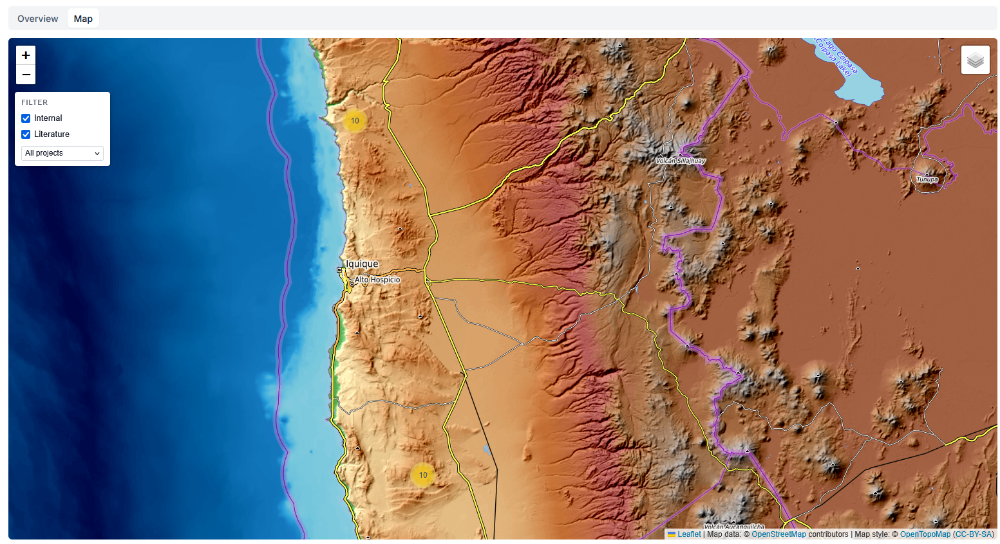
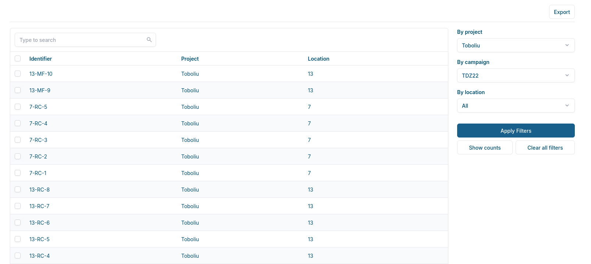
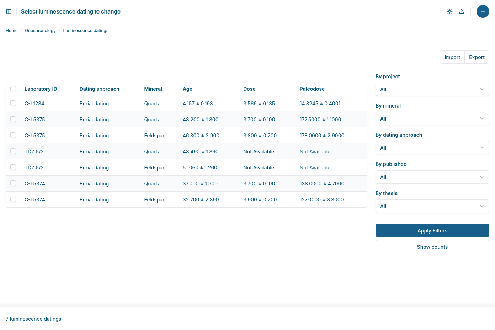

The Cologne Geomorphological Database System (CGDB)  is a comprehensive information system for managing complex geoscientific research data. It is specifically designed to support small research projects that must adhere to strict data management requirements set by funding bodies but often lack the financial and human resources to do so. The framework supports the transformation of raw research data into scientific knowledge. It addresses critical challenges, such as the rapid increase in the volume, variety, and complexity of geoscientific datasets, data heterogeneity, spatial complexity, and the need to comply with the FAIR (Findable, Accessible, Interoperable, and Reusable) principles. The approach optimizes the research management process by enhancing scalability and enabling interdisciplinary integration. It is adaptable to evolving research requirements and supports various data types and methodological approaches, such as machine learning and deep learning, that place high demands on the data and their formats.




## Technology Stack

CGDB is built with:
- **[Django 6.0](https://www.djangoproject.com/)** - Web framework and ORM
- **[Django Unfold](https://github.com/unfoldadmin/django-unfold)** - Modern admin interface
- **[Django REST Framework](https://www.django-rest-framework.org/)** - REST API (`/api/v1/`, see [REST API](#rest-api) below)
- **[Dagster](https://dagster.io/)** (optional) - Data orchestration and ETL pipelines, headless (no UI) — see [Data Orchestration](#data-orchestration-optional)

## Requirements

- Python 3.12+
- GeoDjango dependencies (GDAL, PROJ, GEOS)
- SpatiaLite or PostgreSQL/PostGIS
- Node.js + npm (for the map dashboard's frontend — see "Frontend (map
  dashboard)" below; on a production server this is only needed as a
  one-shot build tool during `python manage.py deploy`, nothing Node-based
  keeps running afterward)

## Installation for local development
To set up the framework for local development, navigate to the desired folder and clone the repository.

```
git clone git@github.com:Cologne-Geomorphological-Software-Lab/CGDB.git
```

```
cd CGDB
```

Set up a virtual environment, activate it and install the project's dependencies:

```
python3 -m venv .venv
source .venv/bin/activate
pip install -r requirements.txt
```

Create a copy of prototype *local_settings_TEMPLATE.py* as *local_settings.py*:

```
cp prototype/local_settings_TEMPLATE.py prototype/local_settings.py
```

For local development, edit local_settings.py with a text editor or an IDE according to the official Django documentation (especially Geodjango: https://docs.djangoproject.com/en/5.2/ref/contrib/gis/install/). It is advisable to use SpatialLite initially for development. Set DEBUG = True. Also, set STATIC_URL and MEDIA_URL to suitable values (for example, "/static/" and "/media/") as shown below:

```
DATABASES = {
    "default": {
        "ENGINE": "django.contrib.gis.db.backends.spatialite",
        "NAME": "db.sqlite3",
    }
}
STATIC_URL = "/static/"
MEDIA_URL = "/media/"
```

Install the geospatial libraries and SpatialLite:

```
sudo apt-get install binutils libproj-dev gdal-bin libsqlite3-mod-spatialite
```

Implement get_secret_key(). Only for local development you can allocate a static key to SECRET_KEY:

```
# WARNING: Do NOT use a static or hardcoded secret key in production!
# Generate a cryptographically secure, random value and NEVER commit real secrets to version control.
# For development only, you can use a placeholder, but be sure to change this for deployment.
def get_secret_key():
    return "!! REPLACE WITH A SECURE RANDOM SECRET KEY !!"

SECRET_KEY = get_secret_key()
```

Migrate the database and create a super user:
```
python manage.py migrate
python manage.py createsuperuser
```

Start the local development server:
```
python manage.py runserver
```

### Frontend (map dashboard)

The `/map/` dashboard's frontend is a Vite-built app under `frontend/`, not
plain static files. In development, Django's templates load it from a Vite
dev server rather than a built bundle.

Install the frontend dependencies once:
```
cd frontend
npm install
cd ..
```

`python manage.py runserver` then starts the Vite dev server automatically
alongside Django (see `PrototypeConfig.ready()` /
`prototype/vite_dev_server.py`) — nothing else to run. If you skip
`npm install`, `runserver` still starts, but prints a warning and leaves the
map dashboard's script unavailable, which shows up in the browser as a
cross-origin/module-load error pointing at `localhost:5173` rather than an
obvious "connection refused".

In production, `VITE_DEV_MODE=false` (the default when `DEBUG=False`) skips
the dev server entirely and serves the built bundle instead. `python manage.py
deploy` (see "Deploying updates" below) runs `npm ci && npm run build` for
you as a one-shot step — it compiles to `static/dist/` and exits, the same
way `uv sync` does; no Node process keeps running afterward. Node/npm just
need to be installed on the server as a build tool, same as GDAL/PostGIS.

## Running the Tests

The test suite uses **pytest** with **pytest-django** and an in-memory SpatiaLite database — no PostgreSQL/PostGIS installation required.

### Prerequisites

#### Linux / macOS
Install the geospatial system libraries (same as for development):

```bash
sudo apt-get install binutils libproj-dev gdal-bin libsqlite3-mod-spatialite   # Debian/Ubuntu
brew install gdal proj spatialite-tools                                          # macOS
```

#### Windows
Install [OSGeo4W](https://trac.osgeo.org/osgeo4w/) (Network Installer → Express Install → GDAL). gThe default install path is `C:\OSGeo4W`.

The `conftest.py` at the project root automatically registers the OSGeo4W DLL directory so that GeoDjango can load its C libraries. No manual environment setup is required.

If you installed OSGeo4W to a non-default path, adjust `SPATIALITE_LIBRARY_PATH` in `prototype/test_settings.py` and the paths in `conftest.py` accordingly.

### Test settings

Tests run against `prototype.test_settings`, which is already configured in `pytest.ini`. This settings module:
- Uses an **in-memory SpatiaLite database** (no migrations required against a real DB)
- Replaces the password hasher with MD5 to speed up user creation in fixtures
- Sets a static `SECRET_KEY` safe for test use only

### Running all tests

From the `CGDB/` directory (where `manage.py` lives):

```bash
pytest
```

### Useful options

```bash
# Run a specific app's tests
pytest prototype/tests/
pytest analysis/tests/

# Run a single test file
pytest analysis/tests/test_luminescence.py

# Run a single test class or method
pytest prototype/tests/test_views.py::StatDataStructureTest
pytest prototype/tests/test_views.py::StatDataStructureTest::test_project_count_reflects_db

# Show verbose output with test names
pytest -v

# Show output (print / logging) from passing tests as well
pytest -s

# Stop after the first failure
pytest -x

# Run only tests matching a keyword
pytest -k "grainsize"

# Measure test coverage (requires pytest-cov)
pytest --cov=. --cov-report=term-missing
```

### Testing against PostGIS

Production runs PostGIS, not SpatiaLite — a few endpoints use GIS-specific SQL
(raw queries, vendor-specific ORM functions) that can behave differently
between the two backends. Tests exercising that code are marked
`@pytest.mark.gis` and are run against **both** backends to catch divergence.
Some functionality (e.g. the landform vector tile endpoint, `ST_AsMVT`) has no
SpatiaLite equivalent at all — those tests are marked `@pytest.mark.postgis_only`
and are excluded from the default suite entirely, since they can only ever
pass against real PostGIS.

Start a local PostGIS instance via the repo-root `docker-compose.yml`:

```bash
docker compose up -d postgis
```

Then run the marked tests against it:

```bash
DJANGO_SETTINGS_MODULE=prototype.test_settings_postgis pytest -m "gis or postgis_only"
```

`prototype/test_settings_postgis.py` reads connection details from
`CGDB_TEST_PG_HOST`/`_PORT`/`_NAME`/`_USER`/`_PASSWORD` env vars, defaulted to
match the compose service. On Windows, GeoDjango still imports GDAL/GEOS at
`django.setup()` regardless of which database backend is active, so the same
OSGeo4W setup described above is required even when testing against PostGIS —
switching database backends does not remove the GDAL dependency.

### Test structure

| App | Location | What is tested |
|---|---|---|
| `prototype` | `prototype/tests/test_models.py` | `Researcher`, `ResearchGroup`, `Project`, `Country`, `Province` models, `BaseModel.save()` audit-trail (`created_by`/`updated_by`) |
| `prototype` | `prototype/tests/test_mixins.py` | All admin permission mixins (`ProjectBased`, `Nested`, `Hybrid`, `Guardian`, `CreatedUpdated`) |
| `prototype` | `prototype/tests/test_views.py` | `stat_data()`, `_build_monthly_performance()`, `dashboard_callback()` |
| `prototype` | `prototype/tests/test_map_views.py` | `/map/` dashboard + the `LocationViewSet.map` GeoJSON action (structure, permission filtering, geometry exclusion) |
| `prototype` | `prototype/tests/test_api_permissions.py` | `IsProjectMember` and the `ProjectPathPermission` family (`SampleScoped`, `CountingScoped`, `MeasurementScoped`, `RawMeasurementScoped`) |
| `prototype` | `prototype/tests/test_middleware.py` | `CurrentUserMiddleware` thread-local request-user tracking |
| `prototype` | `prototype/tests/test_admin.py` | `ProjectAdmin._sync_member_permissions()` (member ↔ Guardian-permission sync) |
| `prototype` | `prototype/tests/test_admin_project_scoping.py` | Regression tests for admin base-class MRO ordering across project-scoped admins |
| `prototype` | `prototype/tests/test_permission_groups.py` | `create_permission_groups()` |
| `prototype` | `prototype/tests/test_signals.py` | `assign_permissions_to_creator` post_save signal |
| `prototype` | `prototype/tests/test_deploy_command.py` | `deploy` management command (step order, `--dry-run`, `--yes`, dirty-tree abort, migration-failure/backup-path reporting, post-restart health checks) |
| `field_data` | `field_data/tests/test_models.py` | `Location`, `Sample`, `StudyArea`, `Transect`, and related models |
| `field_data` | `field_data/tests/test_api.py` | `StudyAreaViewSet.map`/`TransectViewSet.map` GeoJSON actions |
| `field_data` | `field_data/tests/test_admin.py` | `SampleAdmin`'s custom analysis sub-views |
| `field_data` | `field_data/tests/test_filters.py` | FilterSet definitions |
| `field_data` | `field_data/tests/test_forms.py` | Forms |
| `field_data` | `field_data/tests/test_utils.py` | Utility functions (no DB required) |
| `bibliography` | `bibliography/tests/test_models.py` | `Author`, `ReferenceKeyword`, `Reference` str, ordering, relations |
| `bibliography` | `bibliography/tests/test_api.py` | Read-only API for all 3 models; `Reference` visible without project membership (shared-catalog design) |
| `laboratory` | `laboratory/tests/test_models.py` | `Manufacturer`, `Device`, `Accessory`, `Method`, `Calibration`, `Firmware`, `AccessoryParameter` |
| `laboratory` | `laboratory/tests/test_api.py` | Read-only API for all 7 models (`IsAuthenticated`-only, no project scoping) |
| `analysis` | `analysis/tests/test_luminescence.py` | `LuminescenceDating` str, validators, fields, FK protection |
| `analysis` | `analysis/tests/test_grainsize_fromfile.py` | `GrainSize.from_file()` parser (happy path, errors, integration) |
| `analysis` | `analysis/tests/test_grainsize.py` | `GrainSize._reclassify()` (pure unit tests, no DB) |
| `analysis` | `analysis/tests/test_mps_parser.py` | `analysis/mps_parser.py`'s pure `.mps`-file parsing functions (no DB, no Django) |
| `analysis` | `analysis/tests/test_other_models.py` | `RadiocarbonDating`, `Counting`, `Pollen`, `PollenCount`, `GenericMeasurement`, and `GrainSize.save()` reclassification |
| `analysis` | `analysis/tests/test_models.py` | `Algorithm`, `RawMeasurement` |
| `analysis` | `analysis/tests/test_api.py` | Sample-scoped, catalog, and nested-path permission patterns (`GrainSizeViewSet`, `AlgorithmViewSet`, `PollenCountViewSet`) |
| `analysis` | `analysis/tests/test_admin.py` | `SampleContextMixin` redirect logic in `analysis/admin.py` |
| `analysis` | `analysis/tests/test_forms.py` | Forms |
| `geodata` | `geodata/tests/test_models.py` | `Landform` model (str, geometry round-trip, ordering, spatial `__intersects` lookup) |
| `geodata` | `geodata/tests/test_api.py` | `LandformViewSet` (list/detail, bbox-filtered GeoJSON, `IsAuthenticated`-only) |
| `geodata` | `geodata/tests/test_import_landforms.py` | `import_landforms` management command (batching, `--no-clear`, `--source`, malformed-geometry skip) |
| `raster_data` | `raster_data/tests/test_models.py` | `DataSource`, `RasterScene`, `RasterDataset` |
| `raster_data` | `raster_data/tests/test_api.py` | Read/write API + manifest action; `created_by`/`updated_by` set correctly for API-created records via a real session login |
| `orchestration` | `orchestration/tests/test_models.py` | `MaintenanceRun`, `DuckDBTableConfig` |
| `orchestration` | `orchestration/tests/test_admin.py` | `MaintenanceRunAdmin` permissions/actions, `_submit_maintenance_run` (dagster-daemon submission, incl. both a failed launch and a subprocess that never starts) |
| `orchestration` | `orchestration/tests/test_jobs.py` | The three Dagster maintenance jobs (`backup_job`, `duckdb_export_job`, `integrity_check_job`) and `_record_result_file` |
| `orchestration` | `orchestration/tests/test_sensors.py` | `_sync_maintenance_run` and the run-status sensors' `default_status` |
| `orchestration` | `orchestration/tests/test_management.py` | `run_maintenance_job` management command (manual fallback path) |
| `orchestration` | `orchestration/tests/test_signals.py` | `DuckDBTableConfig` default-row seeding |

---

## REST API

CGDB exposes most research data through a DRF-based REST API rooted at
`/api/v1/`, alongside the Django admin. Interactive, browsable
documentation (drf-spectacular / Swagger UI) is available at
`/api/v1/schema/swagger-ui/` once the server is running — that is the
authoritative, always-current list of endpoints; the summary below is a
map of what's covered, not a full reference.

**Authentication** — either works, no endpoint is reachable unauthenticated:
- **Session** (cookie) — if you're logged into the Django admin in the same
  browser, API requests from that browser work with no extra token.
- **Token** — `POST /api/v1/token-auth/` with username + password returns a
  token; send it as `Authorization: Token <key>` for non-browser clients
  (scripts, curl, external tools).

**Coverage by app:**

| App | Access | Notes |
|---|---|---|
| `field_data` | read-only, project-scoped | Locations, Samples, Campaigns, StudyAreas, Layers, Transects, plus GeoJSON `map` actions used by the `/map/` dashboard |
| `analysis` | read-only, project-scoped | All 15 analytical models (luminescence/radiocarbon/cosmogenic dating, grain size, MicroXRF, pollen counts, generic measurements, ...); scoping follows each model's path to its owning `Sample`/`Project` |
| `laboratory` | read-only, catalog | Devices, methods, manufacturers, accessories, calibration — a shared equipment catalog, not project-scoped |
| `bibliography` | read-only, catalog | Authors, keywords, references — a shared literature catalog; visible to any authenticated user regardless of project membership |
| `geodata` | read-only, catalog | Murphy Landform Regions, with bbox-filtered GeoJSON for map rendering |
| `raster_data` | read + create | Raster scenes/datasets, with a manifest action; write access requires the Guardian `add_project` permission on the target project |
| `orchestration` | admin only | No public API — internal maintenance-job tracking, managed entirely through the Django admin |

Project-scoped endpoints filter results to projects the requesting user has
Guardian `view_project` permission on (or records with
`data_source="literature"`, visible to everyone); superusers see everything.

---

## Data Orchestration (Optional)

CGDB includes an optional data orchestration module that provides a boilerplate for implementing data pipelines with [Dagster](https://dagster.io/). This enables data ingestion, ETL processes, data quality checks, integration with OLAP systems like DuckDB or whole analysis pipelines.

The orchestration layer is designed as a **starting point** that can be customised for your specific IT environment.

**To enable:**

**Headless by design — there is no Dagster UI/webserver in this setup, in
dev or in production.** Maintenance jobs are triggered from the Django
admin ("Trigger selected maintenance job(s)"), which submits directly to
the daemon's run queue via `dagster job launch`; nothing depends on a UI
to function, and nothing here ever listens on a network port other than
Django itself. To inspect run history/logs without a UI, use the `dagster`
CLI (e.g. `dagster run list`, `dagster run logs <run-id>`) against the same
`DAGSTER_HOME`, or read `MaintenanceRun.log`/`result_file` in the admin.

1. Uncomment Dagster dependencies in `requirements.txt` and install:
   ```bash
   pip install -r requirements.txt
   ```

2. Set the Dagster home directory:
   ```bash
   export DAGSTER_HOME=$(pwd)/orchestration/dagster_home
   ```
   By default, Dagster's own run storage
   (`orchestration/dagster_home/dagster.yaml`) uses **SQLite**, stored
   under `DAGSTER_HOME` — no further setup needed. This is safe for
   CGDB's actual usage pattern: a single daemon process, jobs triggered
   only manually via the admin action (no scheduler, no multiple
   concurrent workers).

   **Optional — PostgreSQL for higher-throughput deployments** (multiple
   concurrent workers, scheduled runs): edit
   `orchestration/dagster_home/dagster.yaml`, comment out the `sqlite`
   storage block and uncomment the `postgres` block, then set the four
   credentials — this can be the same Postgres instance/host/credentials
   the rest of your deployment already uses, in its own database (e.g.
   `dagster`, separate from the app's DB):
   ```bash
   export DAGSTER_PG_USER=dagster
   export DAGSTER_PG_PASSWORD=...
   export DAGSTER_PG_HOST=localhost
   export DAGSTER_PG_DB=dagster
   ```

3. Start both processes with honcho — dev and production use the same
   two-process setup:
   ```bash
   honcho start
   ```
   - Django: `http://localhost:8000`
   - `dagster-daemon`: headless, no UI, no listening port; picks up runs
     queued via the admin action or a schedule.

   Or individually: `honcho start web` / `honcho start daemon`.

   **Windows note:** `dagster-daemon run`'s process-group signal handling
   targets POSIX and has not been verified on Windows. If it doesn't behave
   correctly there, the fallback is running a maintenance job synchronously
   by hand: `python manage.py run_maintenance_job <backup|duckdb|integrity>
   --run-id <id>` (see that command's docstring in
   `orchestration/management/commands/run_maintenance_job.py`).

### Updating an existing deployment to the daemon-based setup

Older deployments triggered maintenance jobs via a detached
`subprocess.Popen` from the admin, with no daemon and no dedicated Dagster
run storage. Moving an existing deployment onto the current, daemon-based
setup needs the following, in order:

1. **Deploy the new code** and reinstall dependencies — `dagster`/
   `dagster-webserver` require `>=1.13.11`, `dagster-postgres` requires
   `>=0.29.11` (see `pyproject.toml`). No Django migrations are involved;
   this is a config/behavior change, not a schema change.
2. *(Optional — only if using PostgreSQL run storage, see above)* **Create
   a dedicated Postgres database for Dagster's run storage** — reuse the
   same Postgres instance/host/credentials the app's own database already
   runs on, just a separate database name (e.g. `dagster`). Dagster
   creates its own schema in it automatically on first connect; no manual
   migration step is required:
   ```sql
   CREATE DATABASE dagster;
   GRANT ALL PRIVILEGES ON DATABASE dagster TO <your app's DB user>;
   ```
3. *(Optional — only if using PostgreSQL run storage)* **Set the four
   `DAGSTER_PG_*` environment variables** (see above) wherever this
   deployment's other environment variables live. `DAGSTER_HOME` is
   required either way, and is enough on its own for the SQLite default.
4. **Add the daemon as its own supervised process**, alongside whatever
   already runs `web`. If served via Apache/mod_wsgi (not a `web` systemd
   unit of its own), add a *new*, separate systemd unit for the daemon —
   Apache itself doesn't need to know about it. First find the user your
   `WSGIDaemonProcess` already runs as, so the daemon runs as the same
   user rather than a newly-invented one — check your Apache vhost config
   (`/etc/apache2/sites-available/*.conf`) for the `user=`/`group=` on its
   `WSGIDaemonProcess` directive. Then, e.g.
   `/etc/systemd/system/cgdb-dagster-daemon.service`:
   ```ini
   [Unit]
   Description=CGDB Dagster Daemon
   After=network.target postgresql.service

   [Service]
   Type=simple
   User=www-data
   Group=www-data
   WorkingDirectory=/var/www/cgdb
   Environment=DAGSTER_HOME=/var/www/cgdb/orchestration/dagster_home
   # The four lines below are only needed if you switched dagster.yaml to
   # PostgreSQL storage (see step 2/3 above) — omit them for the SQLite default.
   Environment=DAGSTER_PG_USER=...
   Environment=DAGSTER_PG_PASSWORD=...
   Environment=DAGSTER_PG_HOST=...
   Environment=DAGSTER_PG_DB=dagster
   ExecStart=/var/www/cgdb/.venv/bin/dagster-daemon run
   Restart=on-failure
   RestartSec=5

   [Install]
   WantedBy=multi-user.target
   ```
   ```bash
   sudo systemctl daemon-reload
   sudo systemctl enable --now cgdb-dagster-daemon
   ```
   If the previous setup had a separate `dagster` (UI) process configured
   anywhere, remove it: this setup never runs a Dagster UI, in dev or in
   production.
5. **Restart the process serving Django** (`sudo systemctl restart
   apache2` if served via Apache/mod_wsgi — a plain `git pull` is not
   enough, mod_wsgi keeps old code loaded in memory until restarted) so
   the updated admin code (which now submits via `dagster job launch`
   instead of the old `Popen` call) takes effect.
6. **Smoke test**: trigger a maintenance job from the admin's "Trigger
   selected maintenance job(s)" action, and confirm the corresponding
   `MaintenanceRun` transitions from `running` to `success`/`failed` (via
   the run-status sensors in `orchestration/dagster_home/sensors.py`) and
   that `log`/`result_file` get populated. `journalctl -u
   cgdb-dagster-daemon -f` shows the daemon's activity live.

### Deploying updates

Once a deployment is set up, routine updates (pulling new code, syncing
dependencies, building the frontend, migrating, collecting static files, and
restarting `apache2` and `cgdb-dagster-daemon`) are wrapped in a single
management command instead of running each step by hand:

```bash
python manage.py deploy
```

It always runs, in order: a clean-working-tree check, a pre-migrate
database backup (SQLite copy or `pg_dump`, whichever is active), `git pull
--ff-only`, `uv sync`, `npm ci && npm run build` (compiles the map
dashboard's frontend to `static/dist/` and exits — see "Frontend (map
dashboard)" above), `migrate`/`collectstatic`, then restarts both
services and confirms each is actually `active` afterward — not just that
the restart command itself succeeded. On a failed migration, the error
message names the backup's path so you can decide whether to restore it;
nothing is rolled back automatically. It still requires a human at the
keyboard: it asks for interactive confirmation (skip with `--yes`), and
there is no automatic trigger of any kind — no cron, no webhook, no CI. Use
`--dry-run` to print every step without executing anything, e.g. to review
before the first real run on a given server. See
`prototype/management/commands/deploy.py` for the implementation.

The module is intentionally minimal to avoid overhead while providing a complete reference implementation for FAIR-compliant data management workflows.



## References

> Handy, D., van der Meij, W. M., Zickel, M., and Reimann, T.: A database-driven research data framework for integrating and processing high-dimensional geoscientific data, Geosci. Instrum. Method. Data Syst., 15, 165–181, https://doi.org/10.5194/gi-15-165-2026, 2026. 

**Framework Dependencies:**
- Django - [https://www.djangoproject.com/](https://www.djangoproject.com/)
- Django Unfold - [https://github.com/unfoldadmin/django-unfold](https://github.com/unfoldadmin/django-unfold)
- Dagster - [https://dagster.io/](https://dagster.io/)

## License

MIT License - see [LICENSE](LICENSE) file for details.

## Security & Production Notes

**This is a research data framework.** Production deployment requires at least:

1. **Configure `local_settings.py` properly:**
   - Set strong SECRET_KEY (use environment variable)
   - Configure ALLOWED_HOSTS for your domain
   - Set DEBUG=False in production
   - Configure secure database credentials

2. **Production Server:**
   - Use Gunicorn/uWSGI (not Django runserver)
   - Configure reverse proxy (nginx/Apache)
   - Set up SSL/TLS certificates

3. **Additional Security:**
   - Implement rate limiting
   - Set up monitoring and logging
   - Regular security updates
   - Database backups

4. **Separation of OLTP & Data Orchestration:**
   - For production workloads, consider running Dagster on a separate server
   - Use read replicas or separate OLAP databases for analytics workloads
   - Avoid running heavy ETL jobs during peak operational hours

See Django deployment checklist:
https://docs.djangoproject.com/en/stable/howto/deployment/checklist/
